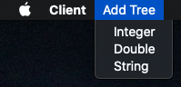
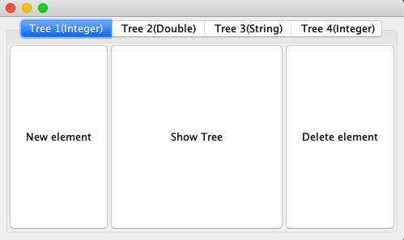
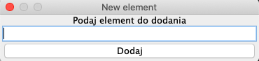
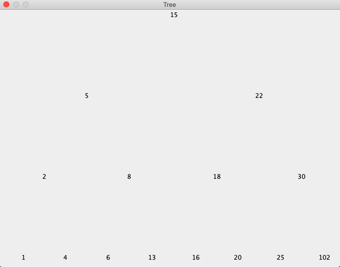
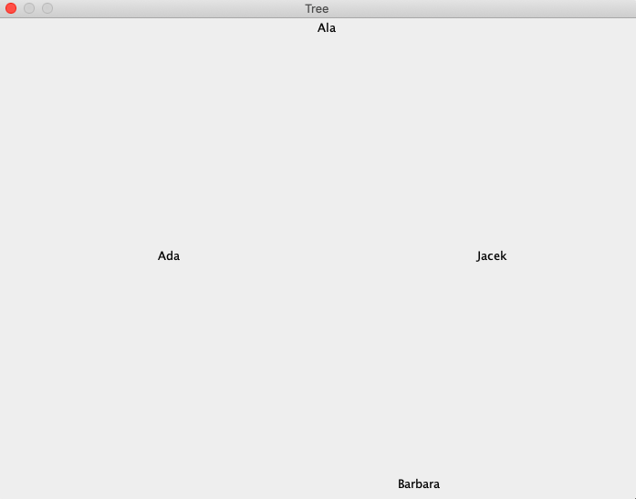
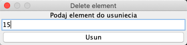
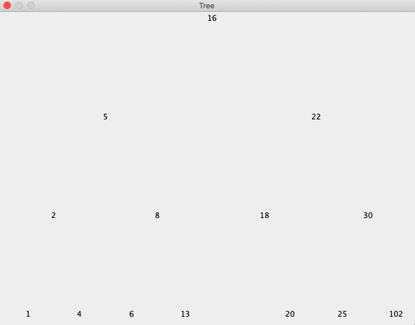

# ClientSerwerB-tree

Implementacja algorytmów drzewa binarnego w technologii klient-serwer.

Klient jest okienową aplikacją umożliwiającą użytkownikowi wysyłania do serwera poleceń dotyczących:

-dodania nowego drzewa

-dodania elementu do istniejącego drzewa

-usunięcie elementu z istniejącego drzewa

-wyświetlenie istniejącego drzewa

Klient wysyła do serwera odpowiednie komendy do obsługi drzewa, przechowywanie oraz operacje na drzewach wykonywane są na serwerze.

Nowe drzewo użytkownik tworzy przy użyciu MenuBar'a poprzez wybranie typu drzewa:

Przykładowy wygląd klienta:

Wywołanie akcji dodania nowego elementu spodowuje wywołanie następujacego okna dialogowego:

Przykłady drzew wyświetlonych po wywołaniu akcji wyświetlenia drzewa:

Wywołanie akcji usunięcia elementu spowoduje wywołanie odpowiedniego okna dialogowego, przykładowo dla pierwszego drzewa mamy:

